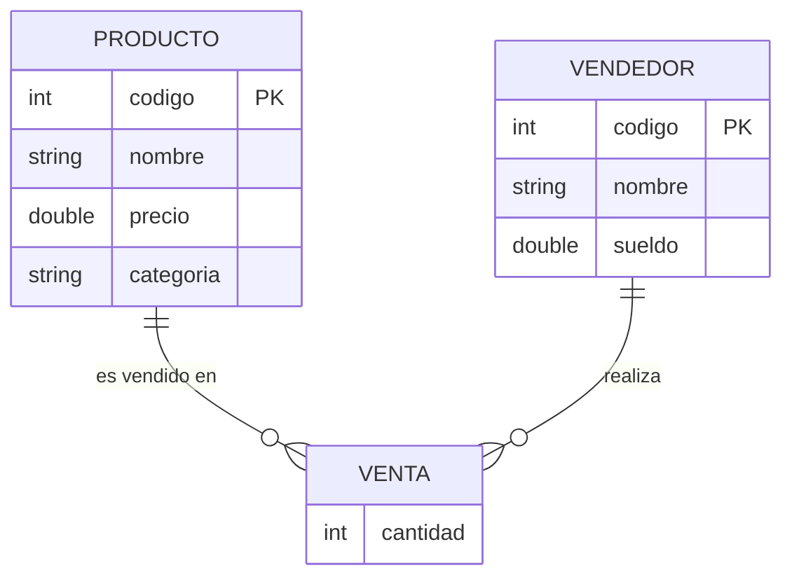

# Tienda de Productos (Java, consola)

Ejercicio técnico para entrevista en empresa Besysoft: aplicación de consola en Java que implementa el manejo básico de una tienda (productos, vendedores y ventas), con datos
almacenados en memoria.

## Estado del proyecto

🚧 En desarrollo. Progreso actual:

- [x] Clases Producto y Vendedor
- [x] Clase Tienda con ArrayList en memoria (alta de productos/vendedores)
- [x] Menú de consola (Main)
- [x] Registrar venta (relacionar producto + vendedor)
- [x] Buscadores de productos (por código, nombre, categoría, rango de precio)
- [x] Cálculo de comisión (5% hasta 2 productos, 10% más de 2)
- [x] Manejo de excepciones
- [x] Diagrama Entidad-Relación

## Estructura

- `Producto.java` — código, nombre, precio, categoría.
- `Vendedor.java` — código, nombre, sueldo.
- `Tienda.java` — guarda productos y vendedores en memoria (ArrayList).

## Diagrama Entidad-Relación

`VENTA` es la entidad que resuelve la relación muchos a muchos entre `PRODUCTO` y `VENDEDOR`: un producto puede aparecer en muchas ventas distintas, y un vendedor puede realizar muchas ventas distintas, pero cada venta puntual conecta exactamente un producto con un vendedor, agregando su propio dato (`cantidad`).
