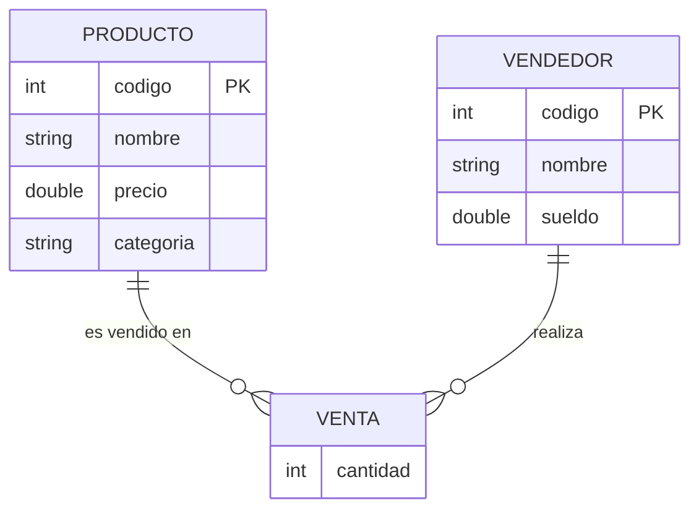

# Tienda de Productos (Java, consola)

Ejercicio técnico para entrevista en Besysoft: aplicación de consola en Java
que maneja productos, vendedores y ventas, con datos en memoria (sin base de datos).

## Estado del proyecto

- [x] Clases Producto y Vendedor
- [x] Tienda con ArrayList en memoria
- [x] Menú de consola (Main)
- [x] Registrar venta (relaciona producto + vendedor)
- [x] Buscadores de productos (código, nombre, categoría, rango de precio)
- [x] Cálculo de comisión (5% hasta 2 productos, 10% más de 2)
- [x] Manejo de excepciones
- [x] Diagrama Entidad-Relación

## Estructura

```
tienda/
 ├── Main.java              Menú de consola
 ├── Producto.java          codigo, nombre, precio, categoria
 ├── Vendedor.java          codigo, nombre, sueldo
 ├── Venta.java             relaciona Producto + Vendedor + cantidad
 ├── Tienda.java            lógica de negocio
 └── exception/             excepciones propias
```

## Cómo ejecutar

```bash
javac tienda/*.java tienda/exception/*.java -d out
java -cp out tienda.Main
```

## Reglas de negocio

**Comisión**: se suman las unidades vendidas por cada vendedor. Hasta 2
unidades → 5% del total vendido. Más de 2 → 10%.

**Buscadores**: por código (exacto), nombre (parcial), categoría (exacto) y
rango de precio.

**Excepciones**: `ProductoNoEncontradoException`, `VendedorNoEncontradoException`
(código inexistente) y `DatoInvalidoException` (precio, sueldo o cantidad
inválidos). Todas checked, atrapadas en `Main` sin cortar la ejecución.

## Diagrama Entidad-Relación



`VENTA` resuelve la relación muchos a muchos entre `PRODUCTO` y `VENDEDOR`,
agregando su propio dato: `cantidad`.
